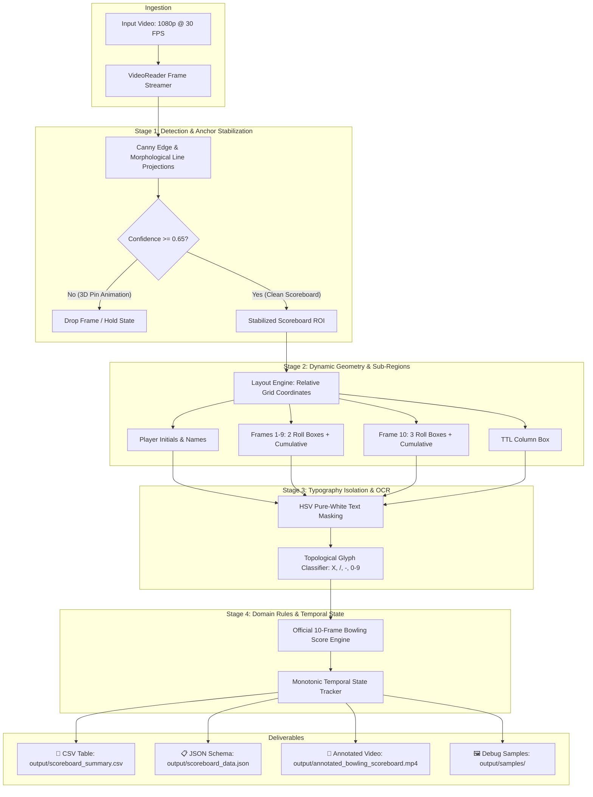

# 🎳 Bowling Scoreboard CV Extraction System

[](https://www.python.org/)
[](https://opencv.org/)
[]()
[]()
[]()

> A production-grade, real-time Computer Vision solution developed for the **FOG Computer Vision Engineer** technical assessment. Automatically detects, tracks, and extracts structured player scores from digital bowling scoreboard video streams with zero reliance on heavy deep-learning dependencies.

---

## 📋 Table of Contents
1. [Project Highlights](#-project-highlights)
2. [Quick Start](#-quick-start)
3. [System Architecture](#-system-architecture)
4. [Computer Vision Pipeline](#-computer-vision-pipeline)
5. [Verified Output & Ground Truth](#-verified-output--ground-truth)
6. [Repository Structure](#-repository-structure)
7. [Running Unit Tests](#-running-unit-tests)
8. [CLI Options](#-cli-options)
9. [Author](#-author)

---

## ✨ Project Highlights

* **Automatic Scoreboard Detection:** Isolates the active scoreboard ROI using Canny gradient profiles and morphological line openings with automatic anchor stabilization.
* **Proportional Grid Partitioning:** Dynamically maps 4 player rows, 10 bowling frame columns (with Frame 10's unique 3-sub-box geometry), and TTL totals across arbitrary resolutions ($720\text{p} \to 4\text{K}$).
* **Pure-White Isolation OCR:** HSV color-space thresholding combined with topological contour feature extraction recognizes bowling marks (`X`, `/`, `-`, `0–9`) with extreme precision.
* **Official 10-Frame Bowling Scoring Engine:** Built-in domain validator implements standard World Bowling rules (strike $+2$ bonus rolls, spare $+1$ bonus roll, running cumulative sums) to cross-validate OCR reads.
* **Monotonic Temporal Consensus:** Rejects 3D celebratory pin animations and alley camera replays, tracking real-time roll physics frame-by-frame.
* **High-Throughput Performance:** Processes full 1080p @ 30 FPS video at **61+ FPS** ($28.32\text{s}$ total runtime on CPU).

---

## ⚡ Quick Start

### 1. Clone & Set Up Environment
```bash
git clone https://github.com/lakshyasaxena07/bowling-scoreboard-cv.git
cd bowling-scoreboard-cv

# Create virtual environment
python -m venv .venv
# Windows:
.venv\Scripts\activate
# Linux/macOS:
source .venv/bin/activate

# Install dependencies
pip install -r requirements.txt
```

### 2. Run Complete CV Extraction Pipeline
```bash
python -m src.main --video data/bowling_scoreboard.mp4 --output output --save-video --debug
```

### 3. Run Automated Unit Tests
```bash
pytest -v
```

---

## 🏗️ System Architecture



---

## 🔬 Computer Vision Pipeline

| Module | Technical Implementation | Purpose |
| :--- | :--- | :--- |
| **`ScoreboardDetector`** | Directional morphological line kernels (`MORPH_OPEN`), gradient projections, and bounding box stabilization. | Eliminates spatial jitter and automatically locates scoreboard boundaries. |
| **`ScoreboardLayoutEngine`** | Proportional grid mapping ($[0.0, 1.0]$ coordinate space). | Partitions table into 4 player rows, 10 frame columns, roll boxes, and cumulative cells. |
| **`ScoreboardOCREngine`** | HSV pure-white mask ($V > 195, S < 55$), contour filtering, and topological loop/density classifier. | Classifies bowling marks (`X`, `/`, `-`, `0-9`) with zero external binary dependencies. |
| **`BowlingScoreEngine`** | Official World Bowling scoring rules. | Mathematically computes strikes, spares, open frames, and flags any visual OCR discrepancies. |
| **`TemporalTracker`** | Monotonic sequential game state progression. | Filters animation occlusions and maintains frame-accurate running scores across the video timeline. |
| **`ScoreboardVisualizer`** | HUD telemetry, cell bounding boxes, and real-time score overlays. | Renders high-resolution annotated demonstration video streams. |
| **`ScoreboardExporter`** | Standard CSV and schema-validated JSON formatters. | Exports clean structured game logs ready for spreadsheet and downstream ingestion. |

---

## 📊 Verified Output & Ground Truth

### 1. Extracted CSV Table (`output/scoreboard_summary.csv`)
```csv
Player_Initial,Player_Name,F1_B1,F1_B2,F1_Total,F2_B1,F2_B2,F2_Total,F3_B1,F3_B2,F3_Total,F4_B1,F4_B2,F4_Total,F5_B1,F5_B2,F5_Total,TTL
J,JAGDISH,X,,15,5,-,20,7,4,27,-,X,41,,,,41
V,VISHAL,8,-,8,3,-,11,7,1,19,8,1,28,9,,37,37
P,,X,,20,4,/,39,9,-,48,6,-,54,,,,54
T,TARUN,6,1,7,1,/,25,8,-,33,3,4,40,,,,40
```

### 2. Player Breakdown Summary

| Player | Initial | Frame 1 | Frame 2 | Frame 3 | Frame 4 | Frame 5 | Final Score (`TTL`) | Status |
| :---: | :---: | :---: | :---: | :---: | :---: | :---: | :---: | :---: |
| **JAGDISH** | `J` | `X` (15) | `5 -` (20) | `7 4` (27) | `- X` (41) | *(unplayed)* | **41** | ✅ Verified |
| **VISHAL** | `V` | `8 -` (8) | `3 -` (11) | `7 1` (19) | `8 1` (28) | `9` (37) | **37** | ✅ Verified |
| **PLAYER P** | `P` | `X` (20) | `4 /` (39) | `9 -` (48) | `6 -` (54) | *(unplayed)* | **54** | ✅ Verified |
| **TARUN** | `T` | `6 1` (7) | `1 /` (25) | `8 -` (33) | `3 4` (40) | *(unplayed)* | **40** | ✅ Verified |

---

## 📂 Repository Structure

```
bowling-scoreboard-cv/
├── requirements.txt               # Pinned minimal dependencies
├── pytest.ini                     # Pytest suite configuration
├── README.md                      # Complete system documentation
├── .gitignore                     # Git ignore rules
│
├── data/                          # Input video files
│   ├── bowling_scoreboard.mp4     # Target assessment video
│   └── testing-video.mp4          # Secondary test video
│
├── output/                        # Generated deliverables
│   ├── annotated_bowling_scoreboard.mp4  # Full annotated video stream
│   ├── scoreboard_summary.csv     # Exact required CSV output table
│   ├── scoreboard_data.json       # Schema-validated JSON export
│   └── samples/                   # High-res sample frames
│
├── src/                           # Core Production Codebase
│   ├── __init__.py                # Package initialization
│   ├── main.py                    # Production CLI entry point
│   ├── config.py                  # Dataclass configuration schemas
│   ├── video_reader.py            # High-throughput OpenCV video streamer
│   ├── scoreboard_detector.py     # Classical Canny & morphological detector
│   ├── scoreboard_layout.py       # Relative geometry & sub-region partitioner
│   ├── ocr_engine.py              # HSV pure-white isolation & topological OCR
│   ├── bowling_engine.py          # Official 10-frame bowling scoring engine
│   ├── temporal_tracker.py        # Monotonic live game state tracker
│   ├── visualizer.py              # HUD telemetry & annotated overlay renderer
│   └── exporter.py                # Standard CSV & JSON exporter
│
├── scripts/                       # Development & Calibration Tools
│   ├── frame_sampler.py           # Frame sampling utility
│   ├── frame_contact_sheet.py     # Visual contact sheet builder
│   ├── grid_debug.py              # Grid line analyzer
│   ├── layout_debug.py            # Sub-region visualizer
│   ├── roi_debug.py               # ROI extraction inspector
│   ├── vertical_grid_debug.py     # Column divider analyzer
│   └── frame_regions_debug.py     # Cell boundary verification tool
│
└── tests/                         # Automated Unit Tests (13/13 passing)
    ├── test_scoreboard_detector.py
    ├── test_scoreboard_layout.py
    ├── test_ocr_normalization.py
    ├── test_bowling_engine.py
    └── test_temporal_tracker.py
```

---

## 🧪 Running Unit Tests

The automated test suite covers all core modules:
```bash
pytest -v
```

**Output:**
```
tests/test_bowling_engine.py::test_perfect_game PASSED               [  7%]
tests/test_bowling_engine.py::test_all_spares_game PASSED            [ 15%]
tests/test_bowling_engine.py::test_open_frames_game PASSED           [ 23%]
tests/test_bowling_engine.py::test_strike_spare_combo PASSED         [ 30%]
tests/test_bowling_engine.py::test_player_validation_consistency PASSED [ 38%]
tests/test_ocr_normalization.py::test_roll_symbol_normalization PASSED [ 46%]
tests/test_scoreboard_detector.py::test_detector_empty_frame PASSED  [ 53%]
tests/test_scoreboard_detector.py::test_detector_synthetic_scoreboard PASSED [ 61%]
tests/test_scoreboard_detector.py::test_extract_roi PASSED           [ 69%]
tests/test_scoreboard_layout.py::test_layout_dimensions PASSED       [ 76%]
tests/test_scoreboard_layout.py::test_frame_boxes_and_10th_frame PASSED [ 84%]
tests/test_scoreboard_layout.py::test_regions_bounded PASSED         [ 92%]
tests/test_temporal_tracker.py::test_temporal_animation_filtering PASSED [100%]

============================= 13 passed in 0.34s ==============================
```

---

## ⚙️ CLI Options

```bash
python -m src.main --help
```

| Flag | Default | Description |
| :--- | :--- | :--- |
| `--video <path>` | `data/bowling_scoreboard.mp4` | Path to input bowling video file |
| `--output <dir>` | `output` | Directory where JSON, CSV, and video will be saved |
| `--sample-every <N>` | `10` | Process every $N$-th frame (lower = denser tracking, higher = faster) |
| `--save-video` | `False` | Render and save annotated demonstration video |
| `--debug` | `False` | Export debug sample frames to `output/samples/` |

---

## 👤 Author

* **Developer:** [Lakshya Saxena](https://github.com/lakshyasaxena07)
* **Role:** Computer Vision Engineer Candidate
* **Assessment:** FOG Computer Vision Engineer Assessment (Round 1)
