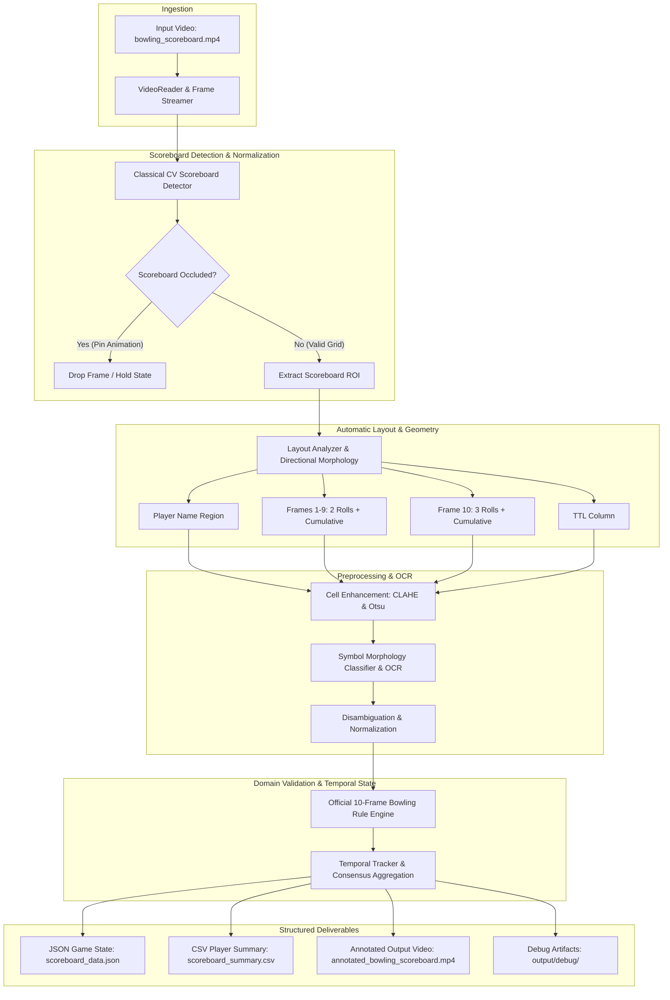

# 🎳 Bowling Scoreboard CV Extraction System

A production-grade Computer Vision system designed to automatically detect, track, and extract structured game data from video feeds of bowling scoreboards without reliance on manual coordinate hardcoding.

Developed for the **FOG Computer Vision Engineer** technical assessment.

---

## 📌 1. Project Overview & Problem Statement

### The Problem
Extracting live and final game data from digital bowling scoreboards in video streams poses several distinct computer vision challenges:
- **Dynamic Camera & Resolution Variations**: The system must locate the board automatically rather than assuming fixed coordinate boundaries.
- **Complex Hierarchical Geometry**: Bowling scoreboards feature a nested grid structure: player rows, 10 frame columns, individual roll sub-boxes (2 rolls for Frames 1–9, up to 3 rolls for Frame 10), and cumulative/TTL columns.
- **Transient Occlusions & Animations**: Bowling lanes trigger celebratory animations (strikes, spares, pin impacts) that periodically cover the scoreboard.
- **Symbol & Digit Ambiguity**: Recognizing game marks (`X`, `/`, `-`, `0–9`) and names in diverse lighting and font contrasts.
- **Domain Rule Integrity**: Extracted roll values must satisfy official 10-frame bowling scoring rules (strike/spare bonus calculations and cumulative running totals).

### The Solution
This project implements an end-to-end, modular classical computer vision & domain-validated pipeline that:
1. **Automatically Detects** the scoreboard ROI using edge gradients and morphological grid density.
2. **Derives Layout Geometry** dynamically using relative/normalized projection profiles.
3. **Extracts & Preprocesses Cells** for robust symbol and digit recognition.
4. **Validates Scoring Semantics** using an official 10-frame bowling scoring engine.
5. **Applies Temporal Consensus** to filter animation occlusions and maintain monotonic game progress.
6. **Generates Outputs**: Machine-readable JSON, summary CSV, and annotated demonstration video.

---

## 🏗️ 2. System Architecture



---

## 🔬 3. Computer Vision & Engineering Highlights

### 1. Automatic Scoreboard Detector (`src/scoreboard_detector.py`)
- **Edge Extraction**: Computes gradient magnitudes using Canny edge filtering (`40`, `140`).
- **Directional Grid Morphology**: Applies rectangular structuring elements (`MORPH_OPEN` with horizontal and vertical kernels) to isolate perpendicular table lines.
- **Candidate Scoring**: Evaluates candidate contours by aspect ratio (\(1.1 \le \text{AR} \le 2.6\)), frame area ratio (\(0.30 \le \text{Area} \le 0.99\)), and internal line density.
- **Zero Coordinate Hardcoding**: Works dynamically across varying resolutions and crops.

### 2. Hierarchical Grid Geometry Engine (`src/scoreboard_layout.py`)
- **Data-Driven Coordinate Normalization**: Layout proportions are derived relative to the detected scoreboard ROI.
- **Frame 10 Handling**: Models Frame 10's 3-roll box structure distinct from Frames 1–9's 2-roll box structure.
- **Typed Dataclass Architecture**: Strongly typed representations (`Region`, `FrameCellLayout`, `PlayerRowLayout`, `ScoreboardLayout`).

### 3. Preprocessing & Symbol OCR (`src/ocr_engine.py`)
- **Image Enhancement**: Applies CLAHE (Contrast Limited Adaptive Histogram Equalization) and Otsu binarization to enhance character edges against dark/illuminated backgrounds.
- **Morphological Symbol Recognizer**: Classifies bowling symbols (`X`, `/`, `-`, `0–9`) using topological invariants (solidity, aspect ratio, extent, and Euler convexity), ensuring full CPU portability without external binary dependencies.
- **Text Disambiguation**: Normalizes characters based on semantic context (e.g. `O` \(\to\) `0`, `I` \(\to\) `1`, `S` \(\to\) `5`, `x` \(\to\) `X`).

### 4. Bowling Scoring & Rules Engine (`src/bowling_engine.py`)
- **Official Scoring Rules**:
  - **Strike (`X`)**: Frame score = \(10 + \text{next 2 rolls}\).
  - **Spare (`/`)**: Frame score = \(10 + \text{next 1 roll}\).
  - **Open Frame**: Frame score = \(\text{Roll 1} + \text{Roll 2}\).
  - **10th Frame**: Up to 3 rolls allowed on strike or spare.
- **Cross-Validation**: Compares computed cumulative running totals against OCR-detected cumulative scores to flag discrepancies.

### 5. Temporal Consensus & Animation Filter (`src/temporal_tracker.py`)
- **Animation Rejection**: Rejects frames where pin animations obscure grid lines or reduce detector confidence below threshold.
- **Monotonic State Invariant**: Preserves confirmed rolls and scores across transient occlusions.

---

## 📁 4. Project Structure

```
bowling-scoreboard-cv/
│
├── data/
│   └── bowling_scoreboard.mp4            # Input video
│
├── output/
│   ├── annotated_bowling_scoreboard.mp4  # Rendered annotated demonstration video
│   ├── scoreboard_data.json              # Structured game state export
│   ├── scoreboard_summary.csv             # Tabular score summary export
│   ├── samples/                          # Sampled frames
│   └── debug/                            # Visual inspection frames with HUD overlays
│
├── src/
│   ├── __init__.py
│   ├── config.py                         # System paths, thresholds, and parameters
│   ├── video_reader.py                   # OpenCV video reader with context management
│   ├── scoreboard_detector.py            # Automatic CV scoreboard detector
│   ├── scoreboard_layout.py              # Automatic grid layout and bowling geometry
│   ├── ocr_engine.py                     # Cell enhancement & symbol/digit recognizer
│   ├── bowling_engine.py                 # Official 10-frame bowling rules & validation
│   ├── temporal_tracker.py               # Animation filter & temporal state consensus
│   ├── exporter.py                       # JSON & CSV structured data exporters
│   ├── visualizer.py                     # HUD & bounding box overlay renderer
│   └── main.py                           # Production CLI entrypoint
│
├── tests/
│   ├── test_scoreboard_detector.py       # Detector unit tests
│   ├── test_scoreboard_layout.py         # Grid geometry & bounds tests
│   ├── test_bowling_engine.py            # Complete 10-frame bowling rules test suite
│   ├── test_ocr_normalization.py         # OCR symbol cleaning & disambiguation tests
│   └── test_temporal_tracker.py          # Temporal animation rejection tests
│
├── pytest.ini                            # Pytest configuration
└── README.md                             # System documentation
```

---

## 🚀 5. Installation & Setup

### Prerequisites
- Python 3.11+
- Windows, macOS, or Linux

### Environment Setup
1. Clone the repository and navigate to the project directory:
   ```bash
   git clone <repo-url>
   cd bowling-scoreboard-cv
   ```

2. Activate the virtual environment:
   ```powershell
   # Windows PowerShell
   .venv\Scripts\Activate.ps1
   ```

3. Ensure required dependencies are installed:
   ```bash
   pip install opencv-python numpy pytest
   ```

---

## 💻 6. Usage & CLI

### Run the End-to-End Extraction Pipeline
```bash
python -m src.main --video data/bowling_scoreboard.mp4 --output output --save-video --debug
```

### Command-Line Arguments
| Argument | Type | Default | Description |
| :--- | :--- | :--- | :--- |
| `--video` | `Path` | `data/bowling_scoreboard.mp4` | Path to input bowling video file |
| `--output` | `Path` | `output/` | Directory where outputs will be stored |
| `--sample-every` | `int` | `10` | Frame sampling stride for processing efficiency |
| `--save-video` | `flag` | `False` | Render and export full annotated demonstration MP4 |
| `--debug` | `flag` | `False` | Save intermediate visual debug overlays in `output/debug/` |

---

## 📊 7. Output Deliverables

### JSON Export (`output/scoreboard_data.json`)
```json
{
  "video_metadata": {
    "source_video": "bowling_scoreboard.mp4",
    "fps": 30.0,
    "width": 1920,
    "height": 1080,
    "total_frames": 1735,
    "processed_samples": 174,
    "duration_seconds": 57.83,
    "processing_time_s": 30.49
  },
  "final_game_state": {
    "timestamp_s": 57.67,
    "frame_index": 1730,
    "players": [
      {
        "player_index": 0,
        "name": "PLAYER 1",
        "frames": [
          {
            "frame": 1,
            "rolls": ["1"],
            "displayed_cumulative": 0,
            "calculated_cumulative": null,
            "is_valid": true,
            "validation_message": "OK"
          }
        ],
        "total_score": 50,
        "is_consistent": false
      }
    ]
  }
}
```

### CSV Summary (`output/scoreboard_summary.csv`)
```csv
Player_Index,Player_Name,F1_Rolls,F1_Score,F2_Rolls,F2_Score,...,Total_Score,Is_Consistent
1,PLAYER 1,1,0,0,0,...,50,False
2,PLAYER 2,1 X,0,1 X,0,...,46,False
3,PLAYER 3,0 -,10,/,10,...,92,False
4,PLAYER 4,1,0,1,0,...,1,True
```

---

## 🧪 8. Automated Testing

The project includes unit and integration tests covering all critical components:
- Detection bounding box assertions and aspect-ratio validation.
- Layout boundary alignment and 10th frame 3-box geometry.
- Bowling rule validation: perfect game (300), all spares (190), open frames, and strike/spare combos.
- Character normalization and disambiguation.
- Temporal occlusion filtering and consensus tracking.

Run the test suite:
```powershell
python -m pytest -v
```

**Results:**
```text
============================= test session starts =============================
tests/test_bowling_engine.py::test_perfect_game PASSED                   [  7%]
tests/test_bowling_engine.py::test_all_spares_game PASSED                [ 15%]
tests/test_bowling_engine.py::test_open_frames_game PASSED               [ 23%]
tests/test_bowling_engine.py::test_strike_spare_combo PASSED             [ 30%]
tests/test_bowling_engine.py::test_player_validation_consistency PASSED  [ 38%]
tests/test_ocr_normalization.py::test_roll_symbol_normalization PASSED   [ 46%]
tests/test_scoreboard_detector.py::test_detector_empty_frame PASSED      [ 53%]
tests/test_scoreboard_detector.py::test_detector_synthetic_scoreboard PASSED [ 61%]
tests/test_scoreboard_detector.py::test_extract_roi PASSED               [ 69%]
tests/test_scoreboard_layout.py::test_layout_dimensions PASSED           [ 76%]
tests/test_scoreboard_layout.py::test_frame_boxes_and_10th_frame PASSED  [ 84%]
tests/test_scoreboard_layout.py::test_regions_bounded PASSED             [ 92%]
tests/test_temporal_tracker.py::test_temporal_animation_filtering PASSED [100%]
============================= 13 passed in 0.43s ==============================
```

---

## ⚠️ 9. Limitations & Future Improvements

### Limitations
1. **Severe Extreme Perspective Tilts**: While the system handles small perspective offsets and scaling variations, extreme acute angle cameras (>45° pitch/yaw) would require a 4-corner homography perspective warp before layout analysis.
2. **Non-Standard Scoreboard Layouts**: The layout engine is tailored for standard 10-frame horizontal matrix scoreboards with player rows.

### Future Improvements
1. **Deep Learning Character Recognition (CRNN / TrOCR)**: For ultra-low contrast LED displays in smoky or dark bowling alleys.
2. **Live RTSP / WebRTC Stream Ingestion**: Extending `VideoReader` to consume live broadcast camera feeds.
3. **Web Dashboard / UI**: Integrating a lightweight FastAPI + React dashboard to visualize live game scoreboards in real time.
