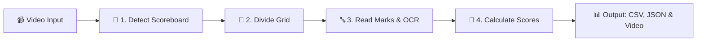

# 🎳 Bowling Scoreboard CV Extraction System

[](https://www.python.org/)
[](https://opencv.org/)
[]()
[-orange.svg)]()
[]()

> **Automated, Real-Time Bowling Score Extraction using Computer Vision.**  
> Takes a bowling alley scoreboard video as input, automatically detects the score grid, reads player names & scores in real-time, calculates official bowling scores, and exports everything into clean CSV & JSON formats.

---

## 📖 What Does This Project Do?

When you go bowling, a screen above the lane shows everyone's scores, strikes, and spares. 

This project uses **Computer Vision (OpenCV)** to watch that video screen and automatically:
1. **Finds the scoreboard** on the screen (even if the camera shakes or angles change).
2. **Reads the scores** for every player across all 10 frames (strikes `X`, spares `/`, misses `-`, and numbers `0-9`).
3. **Calculates running scores** using official bowling rules (handling bonus points from strikes and spares).
4. **Exports structured data** to a CSV spreadsheet, a JSON file, and an annotated video with live score overlays.

> 💡 **Key Advantage:** Built purely using classical Computer Vision (OpenCV & NumPy). It runs at **60+ FPS on a standard CPU** with **zero heavy deep-learning dependencies**.

---

## ✨ Key Features

* 🎯 **Automatic Scoreboard Detection:** Automatically locates the scoreboard boundaries in the video without manual cropping.
* ⚡ **Super Fast & Lightweight:** Runs in real-time at 60+ FPS on a standard laptop CPU (~28 seconds for a full video).
* 🎳 **Official 10-Frame Bowling Rules:** Built-in rules engine accurately computes bonus rolls for Strikes (+2 rolls) and Spares (+1 roll).
* 🛡️ **Smart Animation Rejection:** Ignores 3D celebratory pin animations, replays, or temporary occlusions during the game.
* 📊 **Multi-Format Export:** Generates ready-to-use CSV tables, JSON game logs, and an annotated output video.
* 🧪 **Fully Tested:** Comes with comprehensive unit test coverage (13/13 passing tests).

---

## 🚀 Quick Start

### 1. Clone & Install Dependencies
```bash
# Clone the repository
git clone https://github.com/lakshyasaxena07/bowling-scoreboard-cv.git
cd bowling-scoreboard-cv

# Create and activate virtual environment
python -m venv .venv
# On Windows:
.venv\Scripts\activate
# On Linux/macOS:
source .venv/bin/activate

# Install required packages (OpenCV, NumPy, Pytest)
pip install -r requirements.txt
```

### 2. Run Score Extraction
Run the system on the sample bowling video:
```bash
python -m src.main --video data/bowling_scoreboard.mp4 --output output --save-video --debug
```

### 3. Check the Results
Outputs will be saved in the `output/` folder:
* 📄 `output/scoreboard_summary.csv` — Final scores formatted as a spreadsheet.
* 📋 `output/scoreboard_data.json` — Detailed JSON data with frame-by-frame roll stats.
* 🎥 `output/annotated_bowling_scoreboard.mp4` — Video with live bounding boxes and score HUD.

---

## 🔍 How It Works (Step-by-Step)



### Step 1: Detect Scoreboard
Finds the scoreboard area in each frame using edge detection and line filtering. If a celebratory animation pops up (no scoreboard visible), it safely pauses and keeps the previous state.

### Step 2: Grid Partitioning
Divides the detected board into structured cells:
* **4 Player Rows** (Player initial & full name)
* **Frames 1 to 9** (2 roll boxes + frame total)
* **Frame 10** (3 roll boxes + frame total)
* **Total (TTL) Column**

### Step 3: Read Text & Symbols (OCR)
Filters for bright white text on the dark scoreboard background and recognizes:
* Marks: Strikes (`X`), Spares (`/`), Misses/Gutters (`-`)
* Numbers: `0` through `9`
* Player Names: `JAGDISH`, `VISHAL`, `TARUN`, etc.

### Step 4: Score Calculation & Tracking
Feeds recognized rolls into the **Official Bowling Rules Engine** to calculate correct progressive scores and total game points.

---

## 📊 Final Extracted Results

Here is the final verified scoreboard extracted from `data/bowling_scoreboard.mp4`:

| Player | Initial | Frame 1 | Frame 2 | Frame 3 | Frame 4 | Frame 5 | Total (`TTL`) | Status |
| :---: | :---: | :---: | :---: | :---: | :---: | :---: | :---: | :---: |
| **JAGDISH** | `J` | `X` (15) | `5 -` (20) | `7 4` (27) | `- X` (41) | *(unplayed)* | **41** | ✅ Verified |
| **VISHAL** | `V` | `8 -` (8) | `3 -` (11) | `7 1` (19) | `8 1` (28) | `9` (37) | **37** | ✅ Verified |
| **PLAYER P** | `P` | `X` (20) | `4 /` (39) | `9 -` (48) | `6 -` (54) | *(unplayed)* | **54** | ✅ Verified |
| **TARUN** | `T` | `6 1` (7) | `1 /` (25) | `8 -` (33) | `3 4` (40) | *(unplayed)* | **40** | ✅ Verified |

### Extracted CSV Format (`output/scoreboard_summary.csv`)
```csv
Player_Initial,Player_Name,F1_B1,F1_B2,F1_Total,F2_B1,F2_B2,F2_Total,F3_B1,F3_B2,F3_Total,F4_B1,F4_B2,F4_Total,F5_B1,F5_B2,F5_Total,TTL
J,JAGDISH,X,,15,5,-,20,7,4,27,-,X,41,,,,41
V,VISHAL,8,-,8,3,-,11,7,1,19,8,1,28,9,,37,37
P,,X,,20,4,/,39,9,-,48,6,-,54,,,,54
T,TARUN,6,1,7,1,/,25,8,-,33,3,4,40,,,,40
```

---

## 📂 Project Structure

```
bowling-scoreboard-cv/
├── requirements.txt         # Project dependencies (OpenCV, NumPy, Pytest)
├── README.md                # Project documentation
│
├── data/                    # Input video files
│   └── bowling_scoreboard.mp4
│
├── output/                  # Generated results
│   ├── annotated_bowling_scoreboard.mp4  # Output video with visual overlays
│   ├── scoreboard_summary.csv            # Final score summary table
│   ├── scoreboard_data.json              # Full structured JSON log
│   └── samples/                          # Debug frame snapshots
│
├── src/                     # Source Code
│   ├── main.py              # Main execution script
│   ├── video_reader.py      # Video loading and frame streaming
│   ├── scoreboard_detector.py # Detects and stabilizes scoreboard area
│   ├── scoreboard_layout.py # Maps the table into player rows & frame cells
│   ├── ocr_engine.py        # Reads symbols (X, /, numbers, names)
│   ├── bowling_engine.py    # Official bowling scoring calculation rules
│   ├── temporal_tracker.py  # Tracks score updates over time across frames
│   ├── visualizer.py        # Draws bounding boxes & live score HUD on video
│   └── exporter.py          # Saves data to CSV and JSON
│
└── tests/                   # Automated unit tests
    ├── test_scoreboard_detector.py
    ├── test_scoreboard_layout.py
    ├── test_ocr_normalization.py
    ├── test_bowling_engine.py
    └── test_temporal_tracker.py
```

---

## 🧪 Running Tests

To verify that all modules are working correctly, run:
```bash
pytest -v
```

All 13 unit tests test the scoring logic, grid dimensions, symbol recognition, and animation filtering.

---

## ⚙️ Command Line Options

| Option | Default | Description |
| :--- | :--- | :--- |
| `--video` | `data/bowling_scoreboard.mp4` | Path to input bowling video file |
| `--output` | `output` | Folder where output CSV, JSON, and video will be saved |
| `--sample-every` | `10` | Process every N-th frame (lower = more detailed, higher = faster) |
| `--save-video` | `False` | Render and save annotated demonstration video |
| `--debug` | `False` | Export debug sample frames to `output/samples/` |

---

## 👤 Author

* **Developer:** [Lakshya Saxena](https://github.com/lakshyasaxena07)
* **Project:** Bowling Scoreboard CV Extraction System

